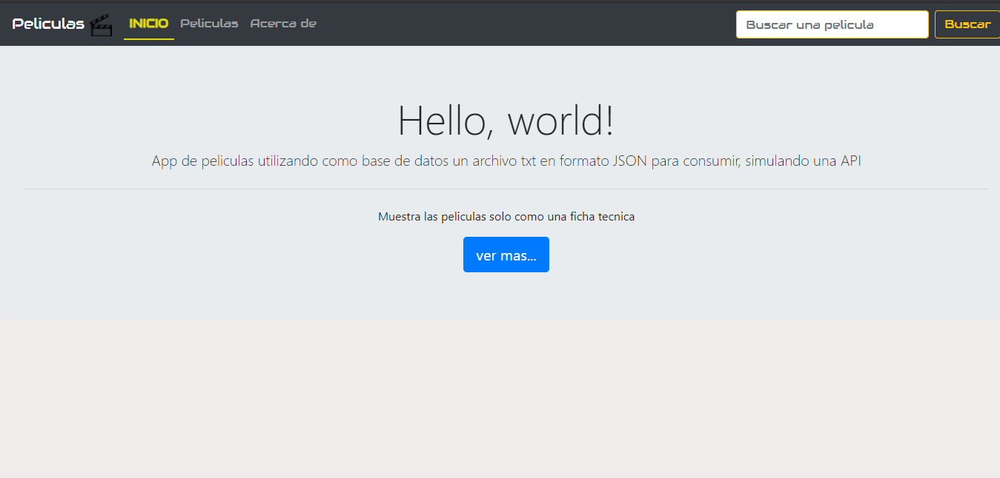
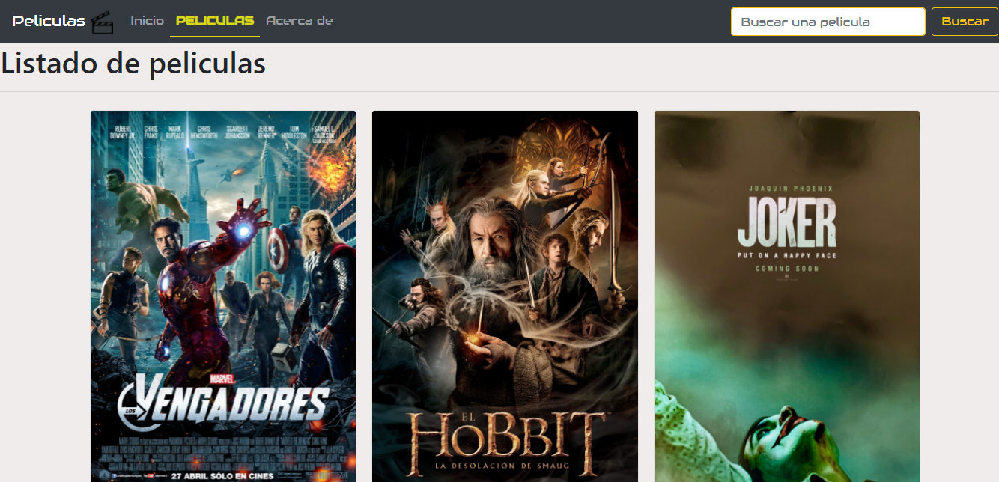
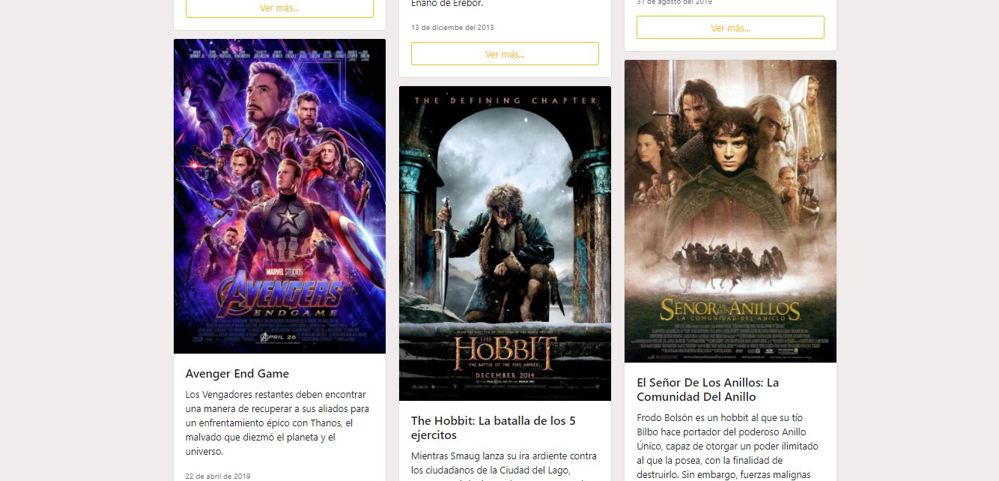
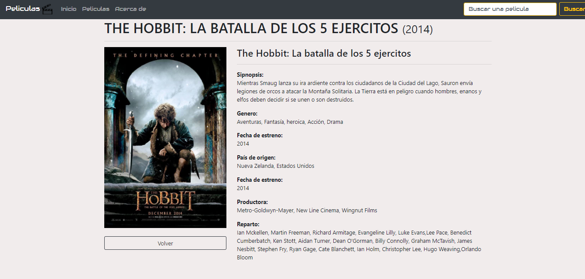
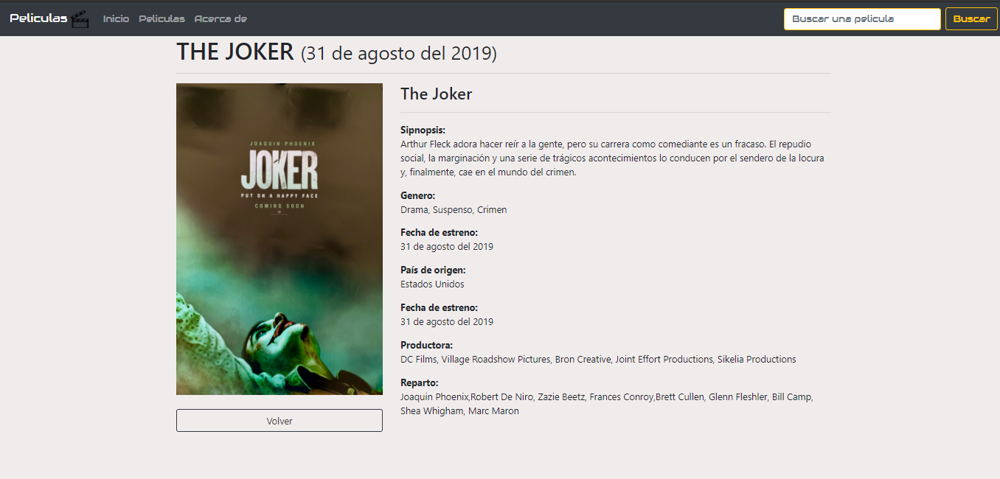
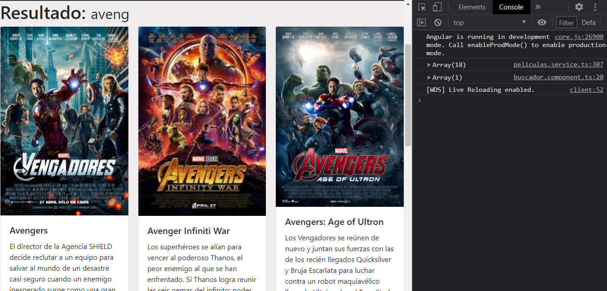

# Peliculas

Aplicación desarrollada en **Angular** en la que muestra un catalago de peliculas, las cuales son consumidas desde un archivo local en formato JSON, la aplicación muestra la lista de peliculas, muestra su ficha tecnica de manera individual utilizando **rutas** y **rutas hijas**, asi como el **routerLink**

#### Capturas

